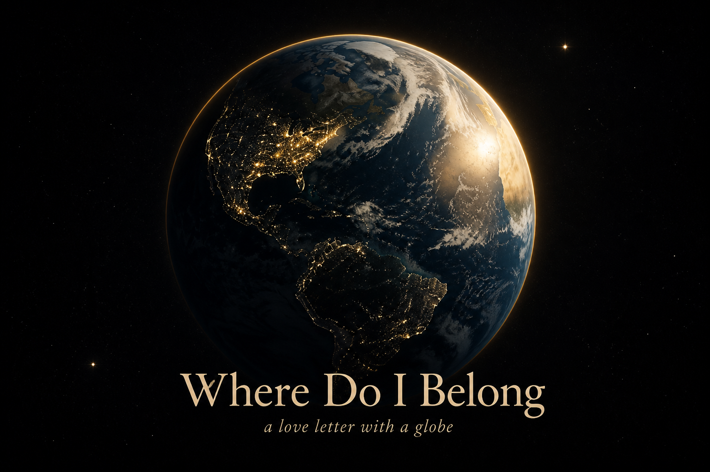

<p align="center">
  
</p>

# Where Do I Belong

A love letter with a globe.

Spin the Earth. Click any place. Ask the compass who lives there — unique people, high-game rooms, high-trust towns — and whether the jobs will let you stay.

This is a **Tauri 2** desktop app: photoreal satellite globe, a belonging atlas, Wikimedia photos, live job boards, and chat through **Ollama Cloud**, **OpenAI**, **Anthropic**, or **OpenRouter**. Without a key, the local compass still flies you to matches.

**Repo:** [github.com/AaronGrace978/Where-Do-I-belong](https://github.com/AaronGrace978/Where-Do-I-belong)

## License

**Proprietary. All rights reserved.** © 2026 Aaron Grace.

You may run official release binaries for personal, non-commercial use. You may not copy, modify, redistribute, or sell the source or binaries without written permission. See [`LICENSE`](LICENSE).

## Install

Releases ship for **Windows**, **macOS** (Apple Silicon + Intel), and **Linux** (x64 + ARM), including the Steam Deck:

[Download the latest release](https://github.com/AaronGrace978/Where-Do-I-belong/releases/latest)

| Platform | Artifact |
| --- | --- |
| Windows | `.msi` / `.exe` |
| macOS | `.dmg` |
| Linux / Steam Deck | `.AppImage` / `.deb` |

### Steam Deck

Use **Desktop Mode**, then install the **x86_64 / amd64 AppImage** (or `.deb` via Discover / `dpkg`).

v1.0.0 ships a WebKitGTK workaround so the window should open dark with the globe — not a blank white screen. If an older build still whites out, update to this release. Game Mode works if you add the AppImage as a non-Steam game; Desktop Mode is the smoother path.

## Run from source

You need [Rust](https://rustup.rs/) and Node.js 22+.

```bash
npm install
npm run tauri dev
```

## Keys (optional)

Open **Keys** in the app:

- [Ollama Cloud](https://ollama.com/settings/keys) — GLM-5.3, Kimi K3, Gemma 4, Qwen 3.5, DeepSeek V4…
- OpenAI — GPT-5.6 Sol and friends
- Anthropic — Claude Fable 5, Opus 5, Sonnet 5
- OpenRouter — one key, many models
- [Cesium ion](https://ion.cesium.com/tokens) — optional World Terrain, OSM buildings, Google Photorealistic 3D cities

Satellite globe works with no token. Scroll in until streets appear.

## Belonging climates

Not a morality score. A weather map.

- **Unique** — originals, weird, neurodivergent, refusing the script
- **High-game** — where manipulators and status animals already live
- **High-trust** — kindness as default
- **Hustle, quiet, chosen family, intellectual, traditional, luxury, creative, tech, diaspora**

Click a chip under the search bar to light those cities.

## Stack

Tauri 2 · React · CesiumJS · Nominatim · Wikipedia/Wikimedia · Arbeitnow / RemoteOK

#loveYourSelf #HonorYourSelf #BeFree
